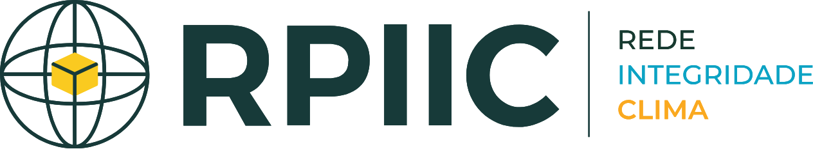

## Novidades

::: {#listing-posts}
:::

## Realização

:::::: grid
::: g-col-4
[{fig-align="center"}](https://www.usp.br/){target="_blank"}
:::

::: g-col-4
[{fig-align="center"}](https://www.iee.usp.br/){target="_blank"}
:::

::: g-col-4
[{fig-align="center"}](https://procam.iee.usp.br/){target="_blank"}
:::
::::::

## Apoio

:::: grid
::: {.g-col-6 .g-start-4}
[{fig-align="center" fig-alt="Rede de Parceiros pela Integridade da Informação sobre a Mudança do Clima" width="360"}](https://integridadeclima.org/){target="_blank"}
:::
::::
